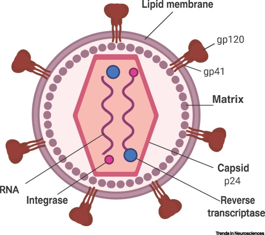

<div style="text-align: justify"> 

The World Health Organization (WHO) reported the number of people living with 
HIV in 2020 to be approximately  37.7 million. The use of antiretroviral therapy(ART) has 
increased the life expectancy in the past years. One of the most prevalent 
comborbidities that persist even during ART is HIV-associated 
neurocognitive disorder (HAND).

### Human Immunodeficiency Virus (HIV) 

HIV is a lentivirus consisting of two single stranded RNA molecules, encoding 
fifteen different viral proteins which are essential for viral replication 
[@Osborne]. At the same time these proteins are potential targets for ART drugs.
The RNA molecules are enclosed in a capsid of p24 protein and the capsid is 
surrounded by a lipid membrane [@Osborne]. The viral envelope glycoprotein (Env)
is responsible for recognizing the host cells and the subsequent fusion of the 
vius with the host cell plasma membrane [@Huarte]. The glycoprotein gp120 binds
to the cluster of differentiation 4 (CD4) receptors on CD4+ T cells, macrophages
and microglia cells [@Osborne]. A structure of the virus particle is shown in 
figure 1 from [@Osborne].

ART drugs circulate the blood and suppress HIV replication of peripheral immune 
cells. However, long-lived cells (eg. CD4+ T cells, macrophages, microglia) can
become persistent HIV reservoirs. This is called latent infection. Latent infection 
means that cells host replication competent HIV in their genome, without virus 
production [@Bandera]. These reservoirs would cause the increase in HIV 
replication as soon as the treatment was interrupted, which is why ART is 
continued as a lifelong treatment [@Wallet].





<details>
  <summary>Click for Answer</summary>
    ```{r, echo=FALSE, eval=TRUE}
    hist(1:10)
    ```
</details> 


<details> 
<summary>Click to Expand</summary> 

### Antiretroviral therapy (ART)

ART drugs target viral enzymes, like reverse transcriptases, proteases or 
integrases. Due to the availability of combinations ART mortality resulting from HIV infection
has been reduced in the past years. Nevertheless, the drugs are not able to 
cure the disease, but only suppress it. The virus persists in latently infected 
cells. One advantage of the viral suppression is that drug resistance mutations
do not occur [@Bandera].

</details>
 
### Microglia & Macrophages

Microglia arise early during development form the yolk sac and they enter the
CNS even before the blood-brain barrier is formed. They form the tissue-resident 
immune cells of the brain and maintain their ability to proliferate [@Réu]. 
Conversely, bone marrow derived monocytes differentiate into macrophages, which 
are peripheral blood-circulating immune cells which do not proliferate anymore
[@DePaula-Silva]. 

Macrophages can adopt two distinct states, pro-inflammatory (M1) or 
anti-inflammatory (M2). Similarly, homeostatic microglia can become 
pro-inflammtory or anti-inflammatory in response to neuronal injury 
[@DePaula-Silva]. During neuroinflammation macrophages also enter the brain, 
contribute to the inflammatory response and 
might acquire microglia markers and microglia function
[@DePaula-Silva; @Grassivaro]. Whether macrophages keep this microglia-like 
signature after they leave the brain is not understood. If they do, there might
be microglia-like macrophages in the CSF. 

### HIV infection in the central nervous system

The blood-brain barrier (BBB) is supposed to prevent pathogens from entering the CNS.
Among the few cells which can pass this barrier are immune cells. Since HIV
primarily infects immune cells it can circumvent the blood brain barrier and 
enter the central nervous system (CNS). Once HIV has entered the CNS it can
infect microglia which live for several years and are therefore an ideal
reservoir for the virus [[@Osborne; @Asahchop; @Farhadian; @Wallet; @Réu]. 
One of the major problems that arises from the HIV 
invasion of the brain is that antiretroviral drugs are either not able to cross the
BBB or they are removed from the brain by ATP-binding efflux pumps [@Osborne].
Consequently, even thought drugs can enter the brain, their concentrations are 
largely reduced in the CSF compared to blood plasma, for example efavirenz
in the plasma reaches concentrations of 9.2–16.6 μmol/ml, but in the CSF it 
only reaches 0.006–0.09 μmol/ml [@Osborne]. In patients
receiving ART the HIV virus is usually not detectable in blood
(undetectable HIV RNA viral load means <50 copies/ml) or cerebrospinal
fluid (CSF), but in the brain this is difficult to test and investigate and, 
therefore, largely unknown [@Asahchop, @Osborne].

Among patients receiving ART there is a high prevalence of HAND, caused by the
persistent infection in the brain and the related immune response [@Saylor]. 
It has even been suggested that ART might dysregulate tight junction proteins 
necessary for the function of BBB and, therefore, contributes to HAND 
[@Rahimy, @Osborne]. According to a meta-analysis HAND has an overall 
prevalence of 43.9% in HIV-infected patients and is categorized into three 
stages [@Wei]:

* asymptomatic neurocognitive impairment (ANI) - 26.2% prevalence
* mild neurocognitive impairment (MND) - 8.5% prevalence
* HIV-associated dementia (HAD) - 2.1 % prevalence

Even thought the severity of HAND has declined due to ART treatment in the past
years, there is a large need for deeper understanding of the molecular mechanisms
behind the disease as well as better diagnostic tools. Since immune cells in the
cerebrospinal fluid reflect the immune cells in the brain, CSF might be used as
a diagnostic tool for neurocognitive disorder [@Farhadian]. Single cell RNA
sequencing (sc-RNAseq) on CSF and blood from HIV-infected patients and healthy 
controls identified a microglia-like subtype of myeloid cells in CSF which were 
not present in blood samples from the same patient [@Farhadian]. HAND strongly
correlates with microglia activation, therefore, understanding the role of 
microglia in HAND might provide interesting insights. 
expression signature of these cells resembles that of disease-associated 
microglia cells and, therefore was proposed to be a microglia-like cell type 
which might be used for diagnosis of HAND from CSF samples [@Farhadian]. 

### HIV infection in microglia

In the following analysis the aim was to provide further evidence for the 
microglia-like nature of these cells by performing additional analysis on the
sc-RNAseq dataset and integrating it with additional datasets from, on the one 
hand a microglia cell line derived from an HIV patient (C20 cell) and, on the 
other hand, a triculture system of induced neurons, astrocytes and microglia, 
infected with HIV and treated with ART [@Ryan; @Garcia-Mesa]. 

The triculture dataset used in the following analysis originates from a 
human-induced pluripotent stem cell model, including induced neurons (iNs),
inuced astrocytes (iAst) and induced microglia (iMg) co-cultured with or without 
HIV infection and antiretroviral therapy (ART) with efavirenz (EFZ) [@Ryan].

The infected iMg exhibited a higher production of proinflammatory cytokines than 
infected iMg treated with EFZ. Levels of IL-1b, IL-1a, IL-8 and TNF-α were
increased in infected +/- EFZ, compared to uninfected conditions, while IL-10 
and IL-6 did not change in any condition [@Ryan]. 

Since the infection states of the cells in this dataset are known, we might be 
able to extract a gene signature of infection, infection + ART compared to
uninfected cells or uninfected cells treated with ART. This gene signature can 
then be compared to the microglia-like cells of the CSF samples. This way we 
might be able to identify infected cells vs uninfected cells in the CSF 
microglia-like cells. This is interesting, because even though the CSF samples 
stem from HIV-infected patients, there will be some cells which are infected 
with the virus, while others are not infected. Being able to differentiate 
between infected and uninfected cells would allow additional inferences about
the effect of HIV infection on microglia.

The infected iMg exhibited a higher production of proinflammatory cytokines than
infected iMg treated with EFZ. Levels of IL-1b, IL-1a, IL-8 and TNF-α were 
increased in infected +/- EFZ, compared to uninfected conditions, while IL-10
and IL-6 did not change in any condition [@Ryan].  
Since the infection states of the cells in this dataset are known, we might be 
able to extract a gene signature of infected cells, infected cells treated with ART compared to 
uninfected cells or uninfected cells treated with ART. This gene signature 
could then be compared to the microglia-like cells of the CSF samples. This way
we might be able to identify infected cells vs uninfected cells in the CSF 
microglia-like cells. This is interesting, because even though the CSF samples
stem from HIV-infected patients, there will be some cells which are infected 
with the virus, while others are not infected. Being able to differentiate 
between infected and uninfected cells would allow additional inferences about
the effect of HIV infection on microglia.

# References

</div>